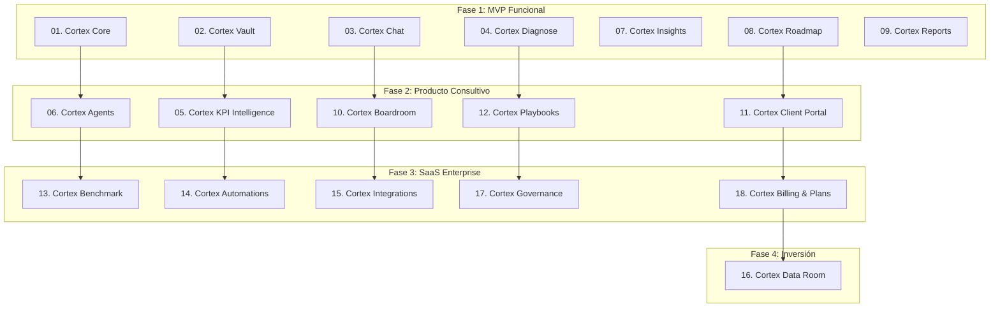

# Syner Cortex - Full Modules Registry & Phasing Plan

This document details the complete 18-module architecture of **Syner Cortex** (AI Consulting Operating System), defining features, cases of use, target personas, and the execution roadmap.

---

## 1. SaaS Modules Registry (18 Modules)

### 01. Cortex Core (Base Platform)
The core infrastructure engine (not sold separately).
- **Features:** JWT authentication, user accounts, tenant organization setup, RBAC (Role-Based Access Control) filters, workspace scopes, activity audit logging, module toggle registry, tenant selection.

### 02. Cortex Vault (Knowledge Base & RAG)
The document ingestion and semantic search engine.
- **Features:** File uploads (PDF, DOCX, XLSX, PPTX, TXT, MD), text extraction, chunking, embedding generation, vector similarity search, cited retrievals, folder mapping per workspace, and document-level access control.
- **Use Cases:** 
  - *"What are the key terms in this client contract?"*
  - *"Find all action items from the last executive meeting minute."*
  - *"Verify if we have completed digital briefs for Client X."*

### 03. Cortex Chat (Conversational AI Consultant)
Interactive workspace chatbot powered by RAG and custom prompts.
- **Features:** Multi-session chats per workspace, source-referenced answers, context file pickers, query prompt templates, executive/analyst conversational mode toggles, and conversion to PDF/Minut.
- **Use Cases:**
  - *"Summarize the current challenges of this tenant."*
  - *"What questions should I ask to complete the operational diagnosis?"*

### 04. Cortex Diagnose (360-Degree Diagnostics)
The primary business analysis tool.
- **Features:** Multi-step questionnaire across 5 core dimensions, SWOT (FODA) matrix compilation, risk matrices, digital maturity assessments, AI-Readiness index, and scoring cards.
- **Dimensions:** Ventas / Comercial, Operaciones, Administración / Finanzas, Recursos Humanos, Tecnología / Madurez Digital.

### 05. Cortex KPI Intelligence (Indicator Dashboard)
Strategic monitoring center.
- **Features:** Custom KPI definition, dimension mapping, red/yellow/green alerts, baseline metrics, trend analyses, and automated explanation of KPI relationships.
- **KPI Metrics catalog:**
  - *Ventas:* Revenue, Margin, Lead Conversion, Ticket, CAC, LTV, Sales Pipeline.
  - *Operaciones:* Productividad, Delivery Time, Inventory Level, Waste/Merma, Efficiency.
  - *Finanzas:* EBITDA, Gross/Net Margins, Cash Flow, Overdue invoices, Budget.
  - *RH:* Churn/Rotación, Absenteeism, Personal Cost, Climate index, Training hours.

### 06. Cortex Agents (Domain AI Specialized Agents)
AI agents acting as specialized consultants:
- **Strategy Agent:** Market analysis, business model, FODA generation, positioning.
- **Founder Agent:** Pitch coaching, MVP scoping, unit economics, fundraising advice.
- **Commercial Agent:** CRM tracking, proposal builder, pricing models, outbound copy.
- **Operations Agent:** Bottleneck detection, supply chain layouts, SOP drafts.
- **Finance Agent:** Budget forecasts, cost-cutting audits, NPV/IRR models.
- **HR Agent:** Org chart modeling, job descriptions, culture, performance templates.
- **Legal Agent:** Contract risk check, compliance audits, regulatory files.
- **PM Agent:** Backlog mapping, task delegation, Gantt progress.
- **Report Builder Agent:** Presentation compiling, corporate briefing templates.
- **Knowledge Curator Agent:** Document cleanup, tagging, duplication checks.

### 07. Cortex Insights (Recommendations Engine)
AI findings interpreter.
- **Features:** Automated insight listings, impact/effort priorization matrix, critical risk alarms, documentary contradiction checks, automation recommendations, and next-steps suggestions.

### 08. Cortex Roadmap (Execution Backlog)
Execution and implementation workspace.
- **Features:** 30/60/90-day task tracking, backlog item creation, owner assignment, due dates, Gantt view, Kanban view, and weekly follow-ups.

### 09. Cortex Reports (Deliverables Compiler)
Fast consulting artifact generation.
- **Features:** Auto-compiles Diagnoses, SWOTs, Risk Matrices, and 30/60/90 Roadmaps into PDF, DOCX, or Markdown files.

### 10. Cortex Boardroom (Executive Center)
C-level control dashboard.
- **Features:** Main KPI cards, active risks list, pending recommendations, roadmap progress, and suggests next strategic actions.

### 11. Cortex Client Portal (Client Collaboration)
Shared client access workspaces.
- **Features:** Tenant logins for Syner clients, shared document views, roadmap checks, task assignments, and consultation chat with limited RAG scope.

### 12. Cortex Playbooks (Methodology Library)
Syner's consulting frameworks database.
- **Features:** industry checklists, prompts database, SOP manuals, industry benchmarks (SME diagnosis, AI Readiness, restructurings).

### 13. Cortex Benchmark (Market Comparisons)
Comparative database.
- **Features:** Industry benchmark metrics, competitor checklists, gap analysis charts, and best practices comparisons.

### 14. Cortex Automations (Workflows)
Event-triggered workflows.
- **Features:** Auto-task creation from uploaded minutes, alert notifications for critical KPIs, automated weekly PDF report emails, and future integrations.

### 15. Cortex Integrations (External Connectors)
- **Features:** Google Drive, Gmail, Calendar, Office 365, Notion, Slack, HubSpot, Zoho, Looker Studio, Odoo, and ERP/POS databases.

### 16. Cortex Data Room (Fundraising & Due Diligence)
Due diligence room for startups.
- **Features:** Pitch Deck, Financial Models, Legal folders, Cap Table, Tracción metrics, IA investor updates generator.

### 17. Cortex Governance (Enterprise Security)
Corporate data compliance.
- **Features:** Advanced file permissions, AI prompt history audits, compliance logs, retencion policies, and human-in-the-loop review queues.

### 18. Cortex Billing & Plans (SaaS Billing)
- **Features:** Subscription tier management, workspace usage quotas, and AI token tracking.

---

## 2. Product Personas
- **Founders:** Need pitch checks, quick roadmaps, and Data Room setups.
- **PyMEs / SMEs:** Need SOP manuals, CRM pipelines, and operations streamlining.
- **Corporates:** Need Governance audits, security controls, and C-level boardroom dashboards.
- **Syner Consultants:** Need Playbooks, Report Compilers, and multi-tenant workspaces.

---

## 3. Product Phasing & Roadmap Plan

